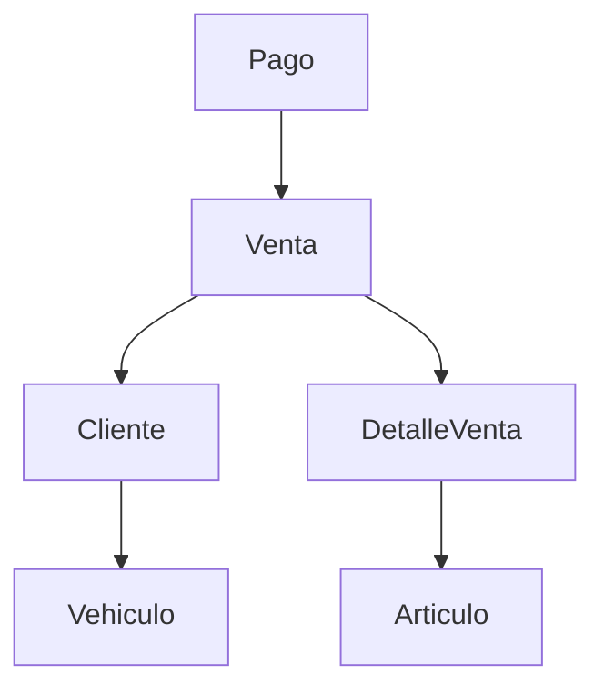
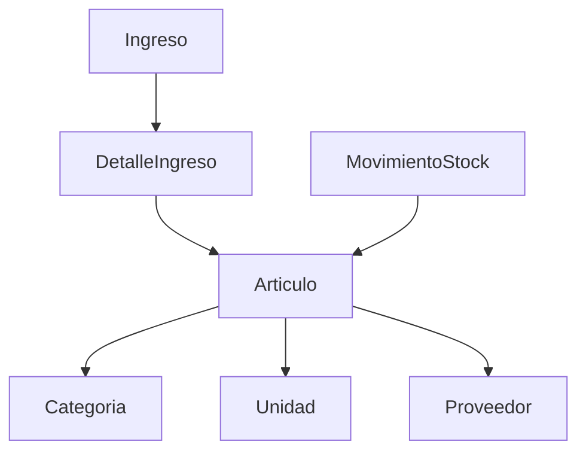
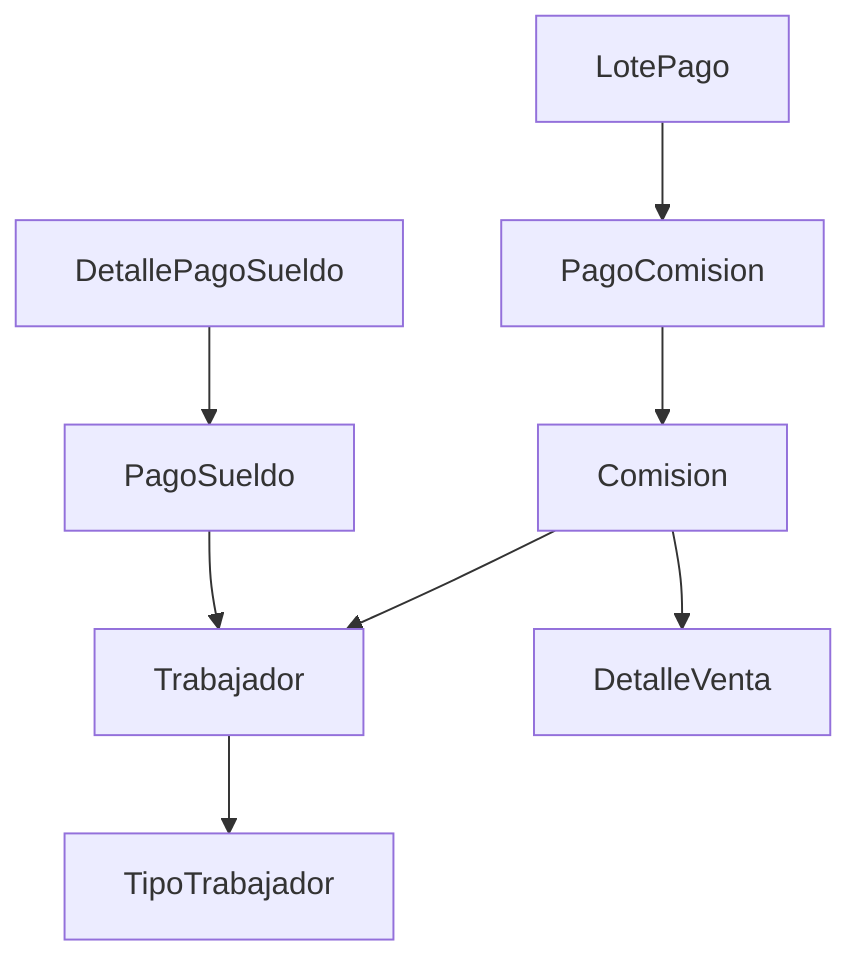

# 🏗️ Arquitectura del Sistema Jireh

## Visión General

Jireh es un sistema de gestión empresarial construido en Laravel 8 que implementa una arquitectura MVC modular con separación clara de responsabilidades.

## Patrones de Diseño Implementados

### 1. **MVC (Model-View-Controller)**
```
Models/     → Lógica de datos y relaciones
Views/      → Presentación (Blade templates)
Controllers/ → Lógica de aplicación
```

### 2. **Repository Pattern** (Implícito en Eloquent)
- Modelos Eloquent actúan como repositories
- Abstracción de acceso a datos
- Facilita testing y mantenimiento

### 3. **Service Layer Pattern**
- `app/Services/` contiene lógica de negocio compleja
- Separación entre controladores y lógica empresarial
- Reutilización de código

### 4. **Factory Pattern**
- `database/factories/` para generación de datos de prueba
- Facilita testing y seeding

## Arquitectura de Módulos

### Módulo Admin
```
app/Http/Controllers/Admin/
├── AdminController.php          # Dashboard principal
├── UsersController.php          # Gestión usuarios
├── ClienteController.php        # Gestión clientes
├── VehiculosController.php      # Gestión vehículos
├── CategoriaController.php      # Categorías productos
├── ConfigController.php         # Configuraciones sistema
├── ProveedorController.php      # Gestión proveedores
├── UnidadController.php         # Unidades de medida
├── ArticuloController.php       # Gestión artículos/productos
├── IngresoController.php        # Ingresos al inventario
├── TrabajadorController.php     # Gestión empleados
├── TipoTrabajadorController.php # Tipos de empleados
├── InventarioController.php     # Control inventario
├── DescuentoController.php      # Gestión descuentos
├── ComisionController.php       # Cálculo comisiones
├── PagoComisionController.php   # Pagos comisiones
├── PagoSueldoController.php     # Pagos sueldos
├── VentaController.php          # Gestión ventas
├── PagoController.php           # Gestión pagos
├── ReporteArticuloController.php # Reportes inventario
├── ReporteMetasController.php   # Reportes metas
└── TestController.php           # Testing/desarrollo
```

### Módulo API
```
app/Http/Controllers/Api/
└── [Controladores API para integración externa]
```

### Módulo Auth
```
app/Http/Controllers/Auth/
└── [Controladores autenticación Laravel UI]
```

## Modelo de Datos

### Entidades Core del Negocio

#### Gestión Comercial


#### Gestión de Inventario


#### Gestión de Personal


## Relaciones Principales

### Relaciones One-to-Many
- `Cliente → Vehiculo`
- `Cliente → Venta`
- `Venta → DetalleVenta`
- `Articulo → DetalleVenta`
- `Trabajador → Comision`
- `LotePago → PagoComision`

### Relaciones Many-to-Many
- `Trabajador ↔ DetalleVenta` (a través de TrabajadorDetalleVenta)

### Relaciones Polimórficas
- Potencial para `Pagos` (múltiples tipos de pago)

## Capas de la Aplicación

### 1. **Capa de Presentación** (Frontend)
```
resources/views/
├── admin/              # Vistas administrativas
├── auth/               # Vistas autenticación
├── layouts/            # Layouts base
└── components/         # Componentes reutilizables
```

### 2. **Capa de Aplicación** (Controllers)
```
app/Http/Controllers/
├── Admin/              # Lógica administrativa
├── Api/                # Endpoints API
└── Auth/               # Autenticación
```

### 3. **Capa de Dominio** (Models + Services)
```
app/Models/             # Entidades del dominio
app/Services/           # Lógica de negocio
app/Traits/             # Comportamientos reutilizables
```

### 4. **Capa de Infraestructura** (Database)
```
database/migrations/    # Esquema de base de datos
database/seeders/       # Datos iniciales
database/factories/     # Generación datos prueba
```

## Flujos de Datos Principales

### Flujo de Ventas
1. **Cliente** realiza compra
2. Se crea **Venta** con detalles
3. Se actualiza **Stock** de artículos
4. Se calculan **Comisiones** para trabajadores
5. Se registran **Pagos**

### Flujo de Inventario
1. **Proveedor** suministra productos
2. Se registra **Ingreso** con detalles
3. Se actualiza **Stock** disponible
4. **Movimientos** quedan auditados

### Flujo de Pagos
1. Se agrupan **Comisiones** en **LotePago**
2. Se procesan **PagoComision** individuales
3. Se registran **PagoSueldo** para empleados
4. Auditoría completa de transacciones

## Principios de Diseño

### 1. **Single Responsibility**
- Cada controlador maneja una entidad específica
- Modelos enfocados en su dominio
- Services especializados

### 2. **Open/Closed**
- Extensible via traits y services
- Modificación mínima de código existente

### 3. **Dependency Injection**
- Laravel Service Container
- Inyección automática en constructores

### 4. **Interface Segregation**
- Contracts específicos para cada servicio
- Interfaces pequeñas y focalizadas

## Consideraciones de Performance

### Base de Datos
- Índices en foreign keys
- Eager loading para relaciones N+1
- Query optimization en reportes

### Cache
- Config cache en producción
- Route cache para optimización
- View cache para templates

### Seguridad
- CSRF protection
- SQL injection prevention (Eloquent)
- XSS protection (Blade)
- Authentication middleware

## Patrones de Testing

### Unit Tests
- Testing de modelos
- Testing de services
- Mocking de dependencias

### Feature Tests
- Testing de endpoints
- Testing de flujos completos
- Testing de autenticación

---

**Convenciones del Proyecto:**
- PSR-4 autoloading
- CamelCase para clases
- snake_case para BD
- Blade templates organizados por módulo